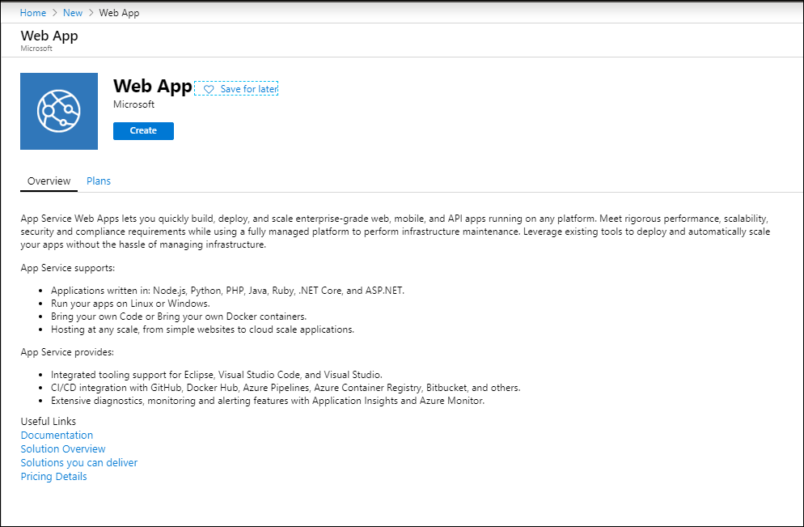
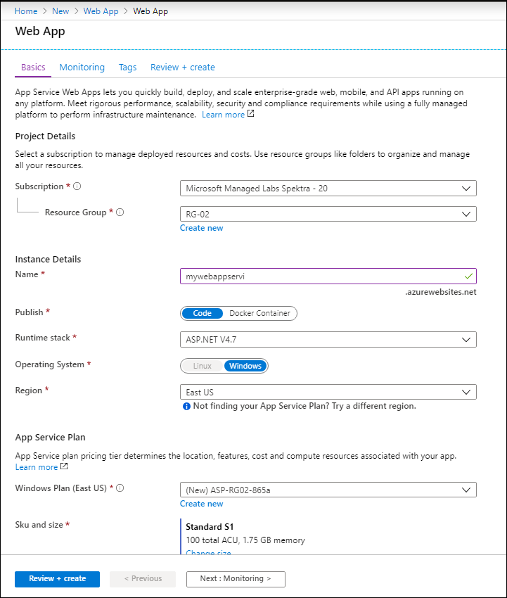

# Module 2: Understand core Azure services (30-35%) 

## Pre-crated Resource Groups

**Resource Group RG-01**
This is a pre-created Resource Group which is empty and can be used to deploy any new Azure resources, if needed.

**Resource Group RG-02**
Another pre-created RG but having resources already deployed in it. Pre-created resources are listed below:

i. Windows Virtual Machines

ii. Load Balancer

iii. Virtual Network

## Lab 1: Try the possible regions in a new resource deployment

In these steps, you will provision a Web App within a single App Service Plan

1.	Sign into the Azure Portal (https://portal.azure.com).
2.	Select +Create a resource, then select Web and finally select Web App. Select the Create button.

On the Create Web App blade, enter the following:

•	Subscription: Select your subscription.

•	Resource Group: Select Use existing, and select the **RG-01** resource group.

•	Name: Provide a unique name

•	Runtime stack: ASP.NET 4.7

•	Publish: Choose Code option.

•	OS: Windows

•	Region: Try any US Region

•	App Service plan: (S1)

•	Select Review and Create to provision both Web App and the App Service Plan. Select the Create button.

•	When provisioning completes, navigate to your new Web App in the portal by selecting on App Services, and then selecting your web app to check out the web app you created. 

## Use of existing Resources you have:

