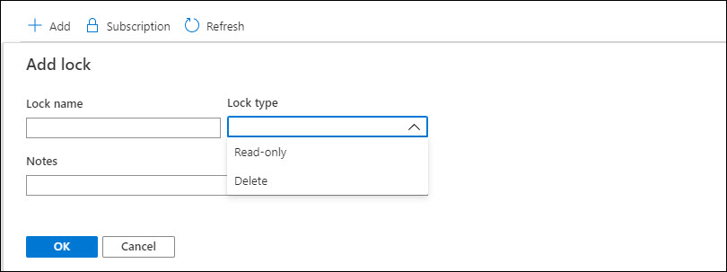
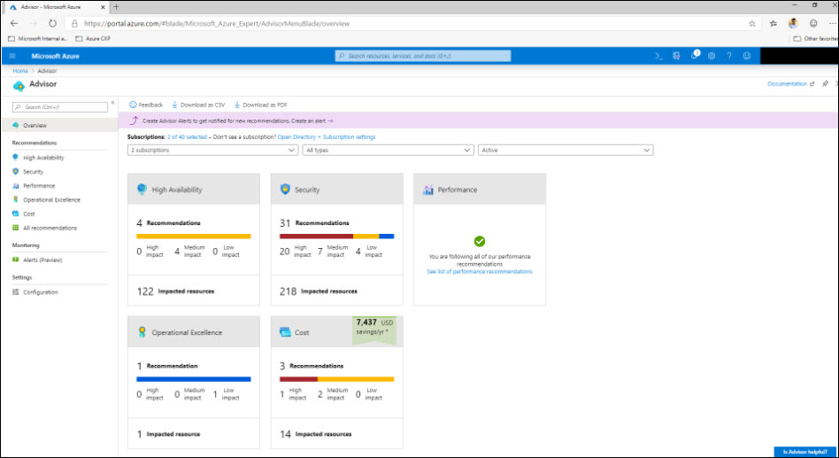
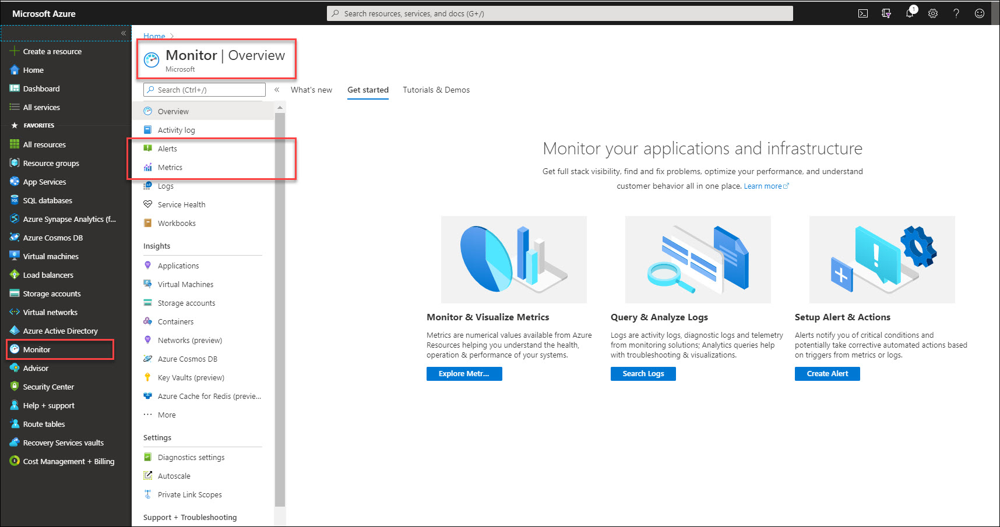

# Module 3: Understand Security, Privacy, Compliance and Trust (25-30%)

In this module, you learn about security, privacy, compliance, and trust with Microsoft Azure

## Lab Contents:

1. Login to azure portal using credentials given in your environment detail page.

2. Verify the Network Security Group:

* Add new rule in existing Network Security Group

3. Go through the Azure Firewall, Azure DDoS and Azure Identity Services

4. Browse Azure Active Directory

5. Browse Multi-factor authentication and Conditional Access Policies

6. Try MFA with student account

7. Browse Azure Information Protection Policies 

## Azure Security Center 

1. Launch Azure Security in Azure portal

2. Go through security alerts/recommendations

## Azure Key Vault:

Azure Key Vault is a tool for securely storing and accessing secrets. A secret is anything that you want to tightly control access to, such as API keys, passwords, or certificates. A vault is a logical group of secrets.

Here are other important terms:

**Tenant:** A tenant is the organization that owns and manages a specific instance of Microsoft cloud services. It's most often used to refer to the set of Azure and Office 365 services for an organization.

**Vault owner:** A vault owner can create a key vault and gain full access and control over it. The vault owner can also set up auditing to log who accesses secrets and keys. Administrators can control the key lifecycle. They can roll to a new version of the key, back it up, and do related tasks.

**Vault consumer:** A vault consumer can perform actions on the assets inside the key vault when the vault owner grants the consumer access. The available actions depend on the permissions granted.

**Resource:** A resource is a manageable item that's available through Azure. Common examples are virtual machine, storage account, web app, database, and virtual network. There are many more.

**Resource group:** A resource group is a container that holds related resources for an Azure solution. The resource group can include all the resources for the solution, or only those resources that you want to manage as a group. You decide how you want to allocate resources to resource groups, based on what makes the most sense for your organization.

**Service principal:** An Azure service principal is a security identity that user-created apps, services, and automation tools use to access specific Azure resources. Think of it as a "user identity" (username and password or certificate) with a specific role, and tightly controlled permissions. A service principal should only need to do specific things, unlike a general user identity. It improves security if you grant it only the minimum permission level that it needs to perform its management tasks.

**Azure Active Directory (Azure AD):** Azure AD is the Active Directory service for a tenant. Each directory has one or more domains. A directory can have many subscriptions associated with it, but only one tenant.

**Azure tenant ID:** A tenant ID is a unique way to identify an Azure AD instance within an Azure subscription.

**Managed identities:** Azure Key Vault provides a way to securely store credentials and other keys and secrets, but your code needs to authenticate to Key Vault to retrieve them. Using a managed identity makes solving this problem simpler by giving Azure services an automatically managed identity in Azure AD. You can use this identity to authenticate to Key Vault or any service that supports Azure AD authentication, without having any credentials in your code. For more information, see the following image and the overview of managed identities for Azure resources.

` Create your Key vault and explore`

## Azure Governance: 

### What is Azure role-based access control (Azure RBAC)?

Access management for cloud resources is a critical function for any organization that is using the cloud. Azure role-based access control (Azure RBAC) helps you manage who has access to Azure resources, what they can do with those resources, and what areas they have access to.

Azure RBAC is an authorization system built on Azure Resource Manager that provides fine-grained access management of Azure resources.

#### What can I do with Azure RBAC?
Here are some examples of what you can do with Azure RBAC:

* Allow one user to manage virtual machines in a subscription and another user to manage virtual networks
* Allow a DBA group to manage SQL databases in a subscription
* Allow a user to manage all resources in a resource group, such as virtual machines, websites, and subnets
* Allow an application to access all resources in a resource group

### What is Azure Policy?

Azure Policy helps to enforce organizational standards and to assess compliance at-scale. Through its compliance dashboard, it provides an aggregated view to evaluate the overall state of the environment, with the ability to drill-down to the per-resource, per-policy granularity. It also helps to bring your resources to compliance through bulk remediation for existing resources and automatic remediation for new resources.

Common use cases for Azure Policy include implementing governance for resource consistency, regulatory compliance, security, cost, and management. Policy definitions for these common use cases are already available in your Azure environment as built-ins to help you get started.

`Try violating policies`

### What is Azure management lock?

As an administrator, you may need to lock a subscription, resource group, or resource to prevent other users in your organization from accidentally deleting or modifying critical resources. You can set the lock level to **CanNotDelete** or **ReadOnly**. In the portal, the locks are called Delete and Read-only respectively.

**CanNotDelete** means authorized users can still read and modify a resource, but they can't delete the resource.

**ReadOnly** means authorized users can read a resource, but they can't delete or update the resource. Applying this lock is similar to restricting all authorized users to the permissions granted by the Reader role. 

    

### What is Azure Blueprints?
   
Just as a blueprint allows an engineer or an architect to sketch a project's design parameters, Azure Blueprints enables cloud architects and central information technology groups to define a repeatable set of Azure resources that implements and adheres to an organization's standards, patterns, and requirements. Azure Blueprints makes it possible for development teams to rapidly build and stand up new environments with trust they're building within organizational compliance with a set of built-in components, such as networking, to speed up development and delivery.

Blueprints are a declarative way to orchestrate the deployment of various resource templates and other artifacts such as:

Role Assignments
Policy Assignments
Azure Resource Manager templates
Resource Groups
The Azure Blueprints service is backed by the globally distributed Azure Cosmos DB. Blueprint objects are replicated to multiple Azure regions. This replication provides low latency, high availability, and consistent access to your blueprint objects, regardless of which region Azure Blueprints deploys your resources to.

### Azure Advisor

What is Advisor?
Advisor is a personalized cloud consultant that helps you follow best practices to optimize your Azure deployments. It analyzes your resource configuration and usage telemetry and then recommends solutions that can help you improve the cost effectiveness, performance, Reliability (formerly called High availability), and security of your Azure resources.

With Advisor, you can:

Get proactive, actionable, and personalized best practices recommendations.
Improve the performance, security, and reliability of your resources, as you identify opportunities to reduce your overall Azure spend.
Get recommendations with proposed actions inline.
You can access Advisor through the Azure portal. Sign in to the portal, locate Advisor in the navigation menu, or search for it in the All services menu. 
    

### Azure Monitor overview

Azure Monitor maximizes the availability and performance of your applications and services by delivering a comprehensive solution for collecting, analyzing, and acting on telemetry from your cloud and on-premises environments. It helps you understand how your applications are performing and proactively identifies issues affecting them and the resources they depend on.

Just a few examples of what you can do with Azure Monitor include:

Detect and diagnose issues across applications and dependencies with Application Insights.
Correlate infrastructure issues with Azure Monitor for VMs and Azure Monitor for Containers.
Drill into your monitoring data with Log Analytics for troubleshooting and deep diagnostics.
Support operations at scale with smart alerts and automated actions.
Create visualizations with Azure dashboards and workbooks.

* Launch Azure Monitor, Browse through matrices, alerts: 

    

### What is Azure Service Health?
  
Azure offers a suite of experiences to keep you informed about the health of your cloud resources. This information includes current and upcoming issues such as service impacting events, planned maintenance, and other changes that may affect your availability.

Azure Service Health is a combination of three separate smaller services.

**Azure status** informs you of service outages in Azure on the Azure Status page. The page is a global view of the health of all Azure services across all Azure regions. The status page is a good reference for incidents with widespread impact, but we strongly recommend that current Azure users leverage Azure service health to stay informed about Azure incidents and maintenance.

**Azure service health** provides a personalized view of the health of the Azure services and regions you're using. This is the best place to look for service impacting communications about outages, planned maintenance activities, and other health advisories because the authenticated Azure Service Health experience knows which services and resources you currently use. The best way to use Service Health is to set up Service Health alerts to notify you via your preferred communication channels when service issues, planned maintenance, or other changes may affect the Azure services and regions you use.

**Azure resource health** provides information about the health of your individual cloud resources such as a specific virtual machine instance. Using Azure Monitor, you can also configure alerts to notify you of availability changes to your cloud resources. Azure Resource Health along with Azure Monitor notifications will help you stay better informed about the availability of your resources minute by minute and quickly assess whether an issue is due to a problem on your side or related to an Azure platform event.
